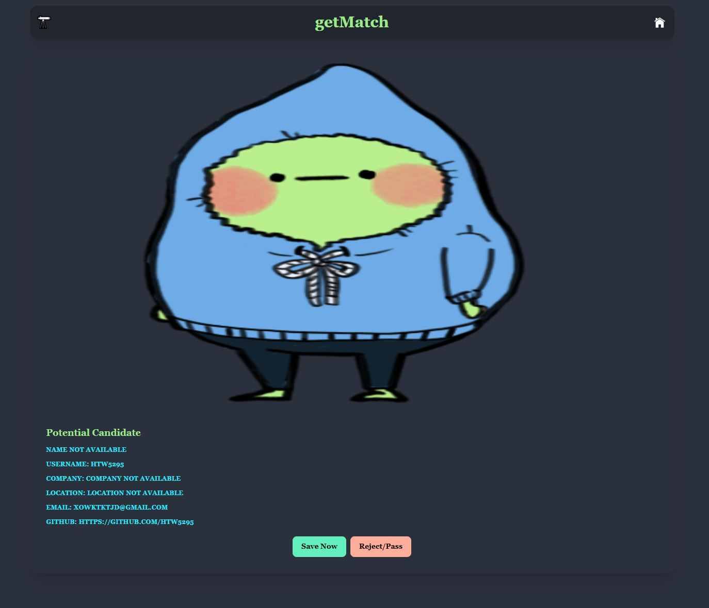
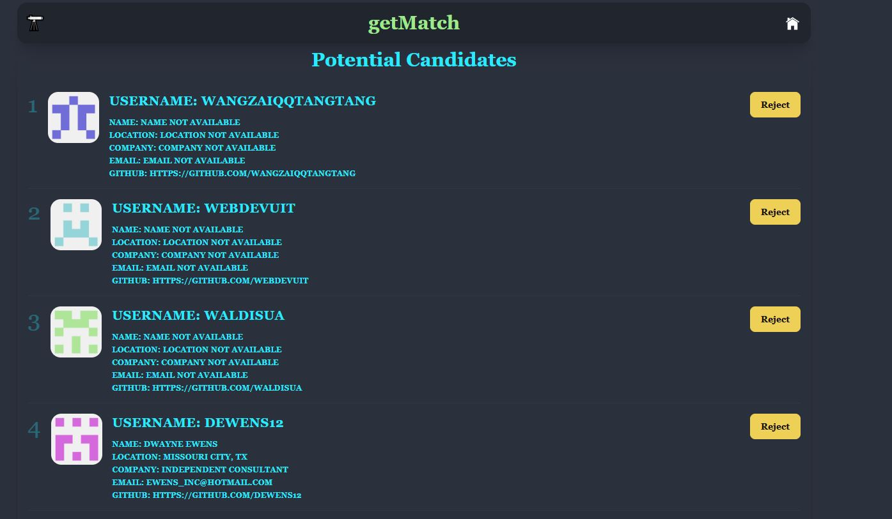

# getMatched

## Description
This candidate search application enables you to explore GitHub profiles and identify top talent for potential hiring. Navigate through a vast selection of developer profiles. 
You can conveniently save profiles of promising candidates, allowing you to revisit and assess them later as part of your hiring process.

## Features
- Save candidate
- Reject candidate

## Technologies
- React
- Typescript
- Vite
- Tailwind CSS Version 4.0.1
- Github API 
- Daisy UI Version 5.0.0 Beta

## Link to deployed website
CLICK HERE: [Link](https://getmatched.onrender.com/)

## Table of Contents (Optional)
- [Installation](#installation)
- [Usage](#usage)
- [Credits](#credits)
- [License](#license)

## Installation
No extra installations are needed to use this web application. Simply access it via your web browser.
If you would like to edit the code, you can fork this repo. You must downloaded all the project dependencies including node.js, typescript, vite, Tailwind, and DaisyUI. You will also have to get access to your own Github API key to set up an .env file.
An .envExample file is available for you to enter your API key.

## Usage
To get started with getMatch simply open the web application and a random profile will appear. Click on either "Save Now" or "Reject/Pass" to save the candidate to your local storage or to skip to the next profile. After selecting your candidates, click on the 🔭 to navigate to a page holding all the candidates "saved". There you can choose to keep the candidate or click "Reject" to remove them from the list. To navigate back to the candidate/home page, please click the home icon located at the navbar.

## Credits
### Contributors
- [Mark Sianipar](https://github.com/MarkSian)

### Reasources used
- Typescript: [LINK](https://www.typescriptlang.org/download/)
- Profesional readMe Guide: [Link](https://coding-boot-camp.github.io/full-stack/github/professional-readme-guide)
- Vite documentation: [Link](https://vite.dev/)
- Genereate github api key: [Link](https://docs.github.com/en/authentication/keeping-your-account-and-data-secure/managing-your-personal-access-tokens#creating-a-fine-grained-personal-access-token)
- Github documentation on rest API: [Link](https://docs.github.com/en/rest/authentication/authenticating-to-the-rest-api?apiVersion=2022-11-28#authenticating-with-a-personal-access-token)
- Deploying to render: [Link](https://coding-boot-camp.github.io/full-stack/render/render-deployment-guide)
- Installing Tailwind: [Link](https://v1.tailwindcss.com/docs/installation)
- Installing DaisyUI: [Link](https://daisyui.com/docs/install/)

## License
MIT License

## Acceptance Criteria
GIVEN a candidate search application
- WHEN the candidate search page loads, THEN the information for one candidate should be displayed, including the candidate's name, username, location, avatar, email, html_url, and company
- WHEN I click the "Save Now" button, THEN the candidate should be saved to the list of potential candidates and the next candidate's information should be displayed
-WHEN I click the "Reject/Pass" button, THEN the next candidate's information should be displayed without saving the current candidate
- WHEN I click the "Reject/Pass" button, THEN the next candidate's information should be displayed without saving the current candidate
- WHEN there are no candidates available to review, THEN an appropriate message should be shown indicating no more candidates are available
- WHEN the potential candidates page loads, THEN the user should see a list of previously saved potential candidates with their name, username, location, avatar, email, html_url, and company
- WHEN the page reloads, THEN the list of potential candidates should persist and be available for viewing

